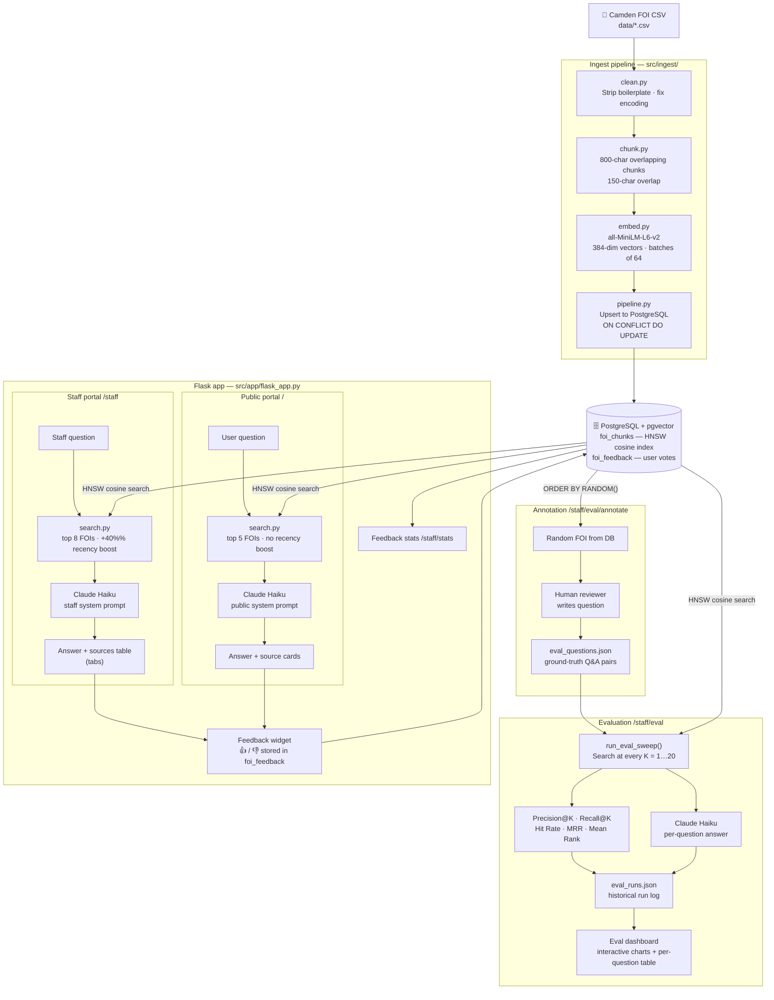

# FOI Tool — Architecture

## Component summary

| Module | Responsibility |
|---|---|
| `src/ingest/clean.py` | Remove FOI boilerplate (header, address block, footer); fix encoding |
| `src/ingest/chunk.py` | Paragraph-aware splitting into 800-char overlapping chunks |
| `src/ingest/embed.py` | Shared `all-MiniLM-L6-v2` model; returns 384-dim float vectors |
| `src/ingest/pipeline.py` | Orchestrates full ingest: load → clean → chunk → embed → upsert |
| `src/db.py` | Connection helper; schema setup (foi_chunks HNSW index, foi_feedback table) |
| `src/retrieval/search.py` | Query embedding → pgvector HNSW → deduplicate to one result per FOI; optional recency boost |
| `src/retrieval/format.py` | Shape hits into LLM context string and UI source dicts |
| `src/app/flask_app.py` | All routes: public portal, staff portal, feedback, eval dashboard, annotation |
| `src/eval/run.py` | Evaluation logic: search sweep across K values; precision, recall, MRR, mean rank; LLM answer generation |
