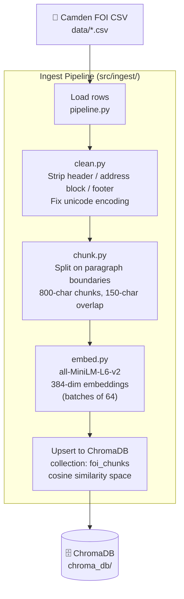
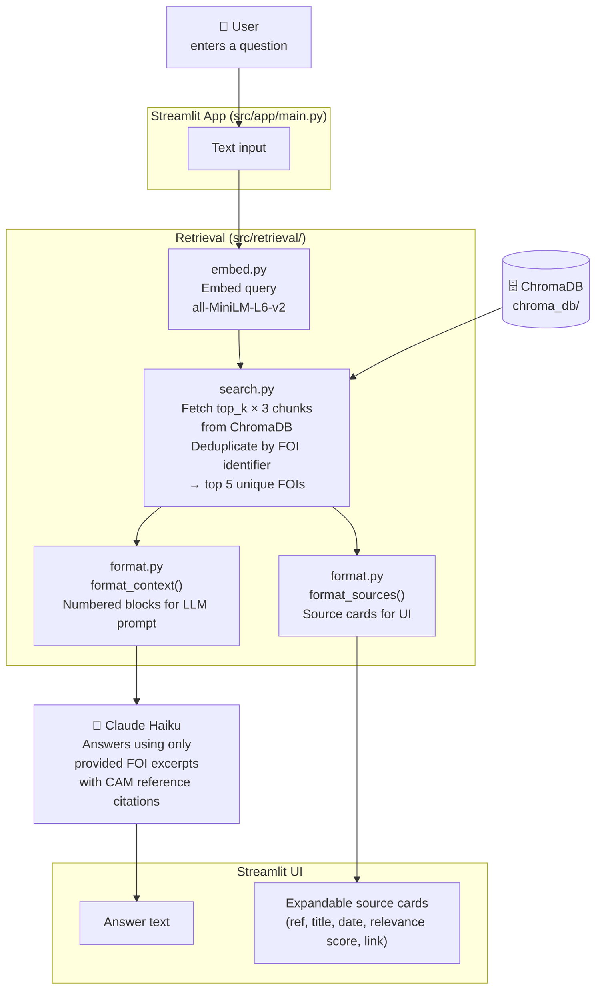

# FOI Tool — Architecture

## Overview

The tool has two distinct flows: an **ingest pipeline** (run once to populate the vector store) and a **query flow** (run on every user request via the Streamlit app).

---

## Ingest Pipeline

Each chunk is stored with metadata: `identifier`, `title`, `date`, `link`, `chunk_index`, `total_chunks`. The pipeline is idempotent — re-running overwrites existing chunks by ID.

---

## Query Flow

---

## Component Summary

| Module | Responsibility |
|---|---|
| `src/ingest/clean.py` | Remove FOI boilerplate (header, address block, footer); fix encoding |
| `src/ingest/chunk.py` | Paragraph-aware splitting into 800-char overlapping chunks |
| `src/ingest/embed.py` | Shared `all-MiniLM-L6-v2` model; returns 384-dim float vectors |
| `src/ingest/pipeline.py` | Orchestrates full ingest: load → clean → chunk → embed → upsert |
| `src/retrieval/search.py` | Query embedding → ChromaDB → deduplicate to one result per FOI |
| `src/retrieval/format.py` | Shape hits into LLM context string and UI source dicts |
| `src/app/main.py` | Streamlit UI; calls retrieval then Claude Haiku for the final answer |
